# AI Demo Central

A guided tour of Sensory AI, Generative AI, and Agentic AI

---

## 1. How to Use This Guide

This README is designed for non technical audiences who want to:

- Understand what each demo does in plain language.
- See why each capability matters for the business.
- Start the demos with a single command where possible.
- Browse screenshots that tell a story without reading code.

The flow is hierarchical:

1. Gallery overview (all four pillars, including Analytical AI).
2. Sensory AI deep dives (see, hear, read the world).
3. Generative AI deep dives (create text, media, code, and insights).
4. Agentic AI deep dives (orchestrate tasks and workflows).

Analytical AI appears in the overview gallery but is not expanded in detail here, in order to keep the focus on live experiential demos.

Wherever possible, exact `docker compose` commands are included to start services.

> If the reader is not the person running Docker, this guide can still serve as an “airplane book” that explains the capabilities while another operator runs the commands.

---

## 2. Gallery Overview: The Four Pillars

The portal home page is the single entry point.

```text
http://localhost:8500
````

Start or restart it with:

```bash
docker compose -f docker-compose.yml up -d --build landing
```

Once it is running, it can be opened in a browser to reveal a gallery of cards representing the four pillars of the platform.

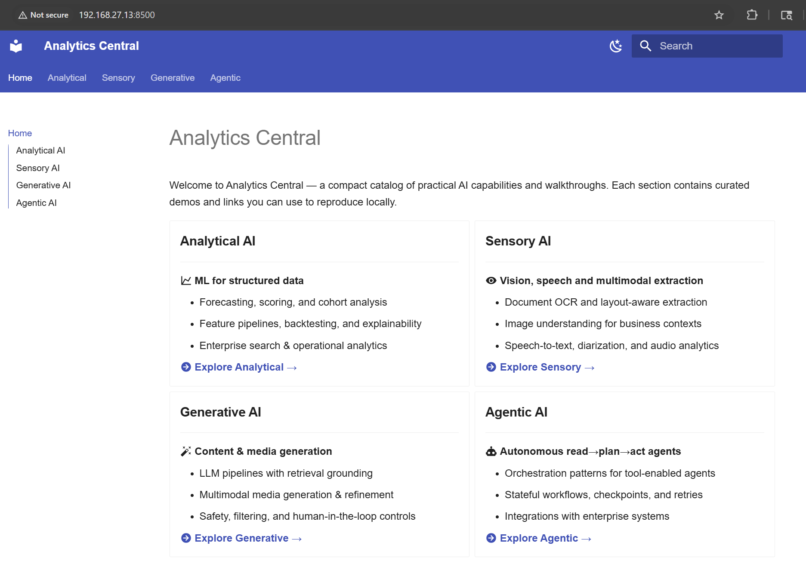

### 2.1 Analytical AI (overview only)

Analytical AI covers classic machine learning over structured data:

* Forecasting (demand, revenue, risk).
* Scoring (propensity, churn, next best action).
* Cohort analysis and segmentation.
* Dashboards and enterprise search over tables.

In this release, Analytical AI is represented primarily in navigation and supporting documentation, rather than as the centerpiece of the live demos. It is often sufficient to note that structured machine learning is already well understood, and that differentiation in this demo suite comes from the next three pillars.

### 2.2 Sensory AI

Sensory AI systems extract meaning from images, videos, documents, and audio:

* Turning scanned documents into searchable text.
* Transcribing calls and meetings into notes and summaries.
* Tracking objects in video (for traffic, safety, operations).
* Capturing field data on a mobile device.

The sequence starts with Sensory AI demos, because they show AI perceiving the real world.

### 2.3 Generative AI

Generative AI systems create new content:

* Text: chat, summarization, translation, research.
* Media: images and video.
* Code: assistants that move from ticket to deployment.
* Slides and reports built from knowledge bases.

These demos showcase how large language models and diffusion models can amplify human work.

### 2.4 Agentic AI

Agentic AI systems do not just respond to prompts. They:

* Read and understand inputs.
* Plan multi step workflows.
* Call tools and APIs.
* Take actions with traceability and guardrails.

Agentic patterns appear inside several demos (Meeting AI, deep research, Flowise, demand letter parsing), and later sections show how these building blocks combine into cohesive agent flows.

---

## 2.5 Ports and Services: Quick Reference Table

To avoid confusion during live demos, here is a normalized reference of all services, their ports, and typical start commands. All URLs assume localhost unless noted otherwise.

| Service Name | Port | URL | Start Command | Description |
|--------------|------|-----|---------------|-------------|
| landing | 8500 | `http://localhost:8500` | `docker compose up -d landing` | MkDocs portal home page |
| docling | 5001 | `http://localhost:5001/ui/` | `docker compose up -d docling` | OCR and document parsing |
| whisperlive | 8501 | `http://localhost:8501` | `docker compose up -d whisperlive` | Real-time transcription |
| meeting_ai | 3880 | `http://localhost:3880` | `docker compose up -d meeting_ai` | Meeting transcription and summaries |
| traffic_tracker | varies | Check docker-compose.yml | `docker compose up -d traffic_tracker` | Video vehicle tracking |
| ollama | 11434 | API only | `docker compose up -d ollama` | Local LLM server |
| openwebui | 34000 | `http://localhost:34000` | `docker compose up -d openwebui` | Chat interface over models |
| comfyui | 8188 | `http://localhost:8188` | `docker compose up -d comfyui` | Image generation canvas |
| flowise | 33000 | `http://localhost:33000` | `docker compose up -d flowise` | Visual RAG builder |
| streamlit_apps | 8503 | `http://localhost:8503` | `docker compose up -d streamlit_apps` | Various Streamlit demos (coding assistant, demand letters, etc.) |
| whybot | 3003 | `http://localhost:3003` | `docker compose up -d whybot` | Deep research agent |

For remote demos, SSH tunnels may be needed (e.g., `ssh -L 8500:localhost:8500 user@remote`).

### 2.6 Start Everything for a Demo Session

To bring up all core services for a comprehensive demo (adjust based on your docker-compose.yml):

```bash
# Stop any existing services
docker compose down

# Start the portal and core sensory demos
docker compose up -d landing docling whisperlive meeting_ai traffic_tracker

# Start generative components
docker compose up -d ollama openwebui comfyui flowise streamlit_apps

# Start agentic components
docker compose up -d whybot

# Check status
docker compose ps

# Open key URLs:
# Portal: http://localhost:8500
# Docling: http://localhost:5001/ui/
# WhisperLive: http://localhost:8501
# Meeting AI: http://localhost:3880
# OpenWebUI: http://localhost:34000
# ComfyUI: http://localhost:8188
# Flowise: http://localhost:33000
# Streamlit Apps: http://localhost:8503
# Whybot: http://localhost:3003
```

This script ensures all services are running before starting the presentation.

---

## 3. Sensory AI Deep Dives

Sensory AI is the natural starting point for the demo story.

A concise framing line:

> “First, AI is taught to see, hear, and read the world responsibly. Once reality is perceived, insights and actions can follow with confidence.”

### 3.1 Sensory AI Demo Map

The following table acts as a quick mental map.

| Demo                                  | What it does                                                                            | How to start                                                                 | Where to open                    |
| ------------------------------------- | --------------------------------------------------------------------------------------- | ---------------------------------------------------------------------------- | -------------------------------- |
| Case Manager (AI at the Edge)         | Mobile app for capturing cases in the field (notes, voice, documents, photos, contacts) | Install APK on an Android device                                             | On the device, open Case Manager |
| Docling OCR & Document Parsing        | Browser based OCR and layout aware parsing for PDFs and images                          | `docker compose -f docker-compose.yml up -d docling`                         | `http://localhost:5001/ui/`      |
| Real Time Transcription (WhisperLive) | Live speech to text in the browser                                                      | `docker compose -f docker-compose.yml up -d whisperlive`                     | `http://localhost:8501`          |
| Meeting AI (Multimedia Intelligence)  | On device meeting assistant: diarization, transcripts, summaries                        | `docker compose -f docker-compose.yml up -d meeting_ai` (name may vary)      | `http://localhost:3880`          |
| Video Intelligence (Traffic Tracking) | Real time vehicle segmentation and tracking from video                                  | `docker compose -f docker-compose.yml up -d traffic_tracker` (name may vary) | Streamlit or app URL for tracker |

For non technical audiences, the emphasis can remain on outcomes rather than ports and implementation details.

---

### 3.2 AI at the Edge: Case Manager App

#### 3.2.1 Beginners Start Here

**What this demo does:** A mobile app that lets field staff capture case information (notes, voice, documents, photos, contacts) on their devices.

**Why it matters to business:** Field workers can collect rich, multi-format data in real-time, which feeds directly into Sensory, Generative, and Analytical AI systems for faster processing and insights.

**Three steps to start it:**
1. Download and install the APK on an Android device.
2. Open the Case Manager app.
3. Create a new case and start adding notes, photos, or voice memos.

**Recognition screenshot:** Main case view showing captured content types.


**How to talk about this demo on a call:** "This demonstrates AI at the edge—bringing intelligent data capture to mobile devices. Instead of paper forms or delayed data entry, field teams can instantly collect everything from voice notes to scanned documents, creating a digital binder that AI can immediately process for insights."

#### 3.2.2 Concept

Field staff rarely sit in front of a laptop. Typical activities include:

* Walking job sites.
* Inspecting assets.
* Meeting customers.
* Collecting messy, multi format information.

The Case Manager app gives each user a single “digital binder” per case, where all relevant information can be captured on the go and later fed into downstream AI systems.

Each case functions like a digital folder that can hold:

* Text notes.
* Voice memos.
* Scanned documents and file attachments.
* Contacts.
* Handwritten ink notes with recognition.
* Photos and other multimedia.

#### 3.2.3 Installation (non technical path)

Developer tools are not required if an APK has already been built.

1. Obtain the APK file, for example `case_manager_nov_4.apk` from the repository.
2. On an Android phone or tablet, copy or download the APK.
3. On the device, allow installation from “unknown apps” for the browser or file manager that will be used.
4. Tap the APK in the Downloads list or file manager.
5. Accept installation and required permissions (camera, microphone, storage, NFC if used).
6. Open the Case Manager icon once installation completes.

Relevant files in the `assets/` folder:

* [Case Manager APK](landing/docs/assets/case_manager_nov_4.apk)
* [Installation Guide for the Case Manager App (PDF)](landing/docs/assets/Installation%20Guide%20for%20the%20Case%20Manager%20App.pdf)
* [Usage Guide for the Case Manager App (PDF)](landing/docs/assets/Usage%20Guide%20for%20the%20Case%20Manager%20App.pdf)

#### 3.2.4 Key capabilities

When the app opens, a “case” appears as the central unit of organization.

Within a case it is possible to:

* Create text notes for quick thoughts.
* Record voice memos for interviews or instructions.
* Scan documents such as business cards, memos, or blueprints.
* Import or create contacts related to the case.
* Draw ink notes with a finger or stylus and let the app recognize handwriting.
* Capture photos or videos and attach them to the case.
* Export the entire case as JSON for downstream systems.
* Share contact details via NFC, AirDrop, or email.

This can be positioned as “sensory on the edge”: the device collects rich data that can later be processed by Sensory AI, Generative AI, and Analytical AI components.

---

### 3.3 Docling OCR & Document Parsing

#### 3.3.1 Beginners Start Here

**What this demo does:** A browser-based tool that extracts text, layout, and tables from PDFs, images, and documents using OCR and layout analysis.

**Why it matters to business:** Unlocks "dark data" in legacy documents, making them searchable and integrable into AI workflows for faster insights and automation.

**Three steps to start it:**
1. Run `docker compose -f docker-compose.yml up -d docling`.
2. Open `http://localhost:5001/ui/` in a browser.
3. Drag and drop a document to see the extracted content.

**Recognition screenshot:** Docling UI showing uploaded document with extracted text and layout structure.

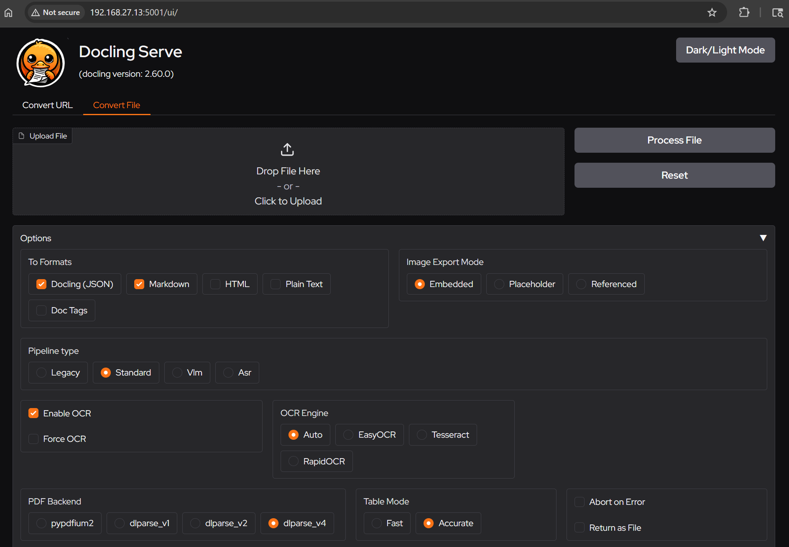

**How to talk about this demo on a call:** "Docling turns scanned PDFs and images into structured data. Watch as it extracts not just text, but also preserves the layout and tables—perfect for automating document processing in insurance, legal, or any industry with paperwork."

#### 3.3.2 Concept

Many organizations are full of legacy PDFs, scans, and images that behave like “dark data”. Docling translates these into structured, searchable content.

Users can:

* Drag and drop PDF, image, or Office files into the browser.
* Visually inspect OCR output.
* Review extracted text, layout, and tables.
* Send the same extraction logic to downstream systems via an API.

Sample documents in the `assets/` folder:

* [Sample visual document (PNG)](landing/docs/assets/sample_visual.png)
* [Visual parsing example (PDF)](landing/docs/assets/visual_parsing.pdf)

#### 3.3.3 Starting the service

```bash
docker compose -f docker-compose.yml up -d docling
```

Open the UI:

```text
http://localhost:5001/ui/
```

#### 3.3.4 Screenshots

Docling upload interface showing drag-and-drop area for PDFs and images:


Extracted content display with preserved layout, text, and table structures (look for bounding boxes around elements and structured data extraction):

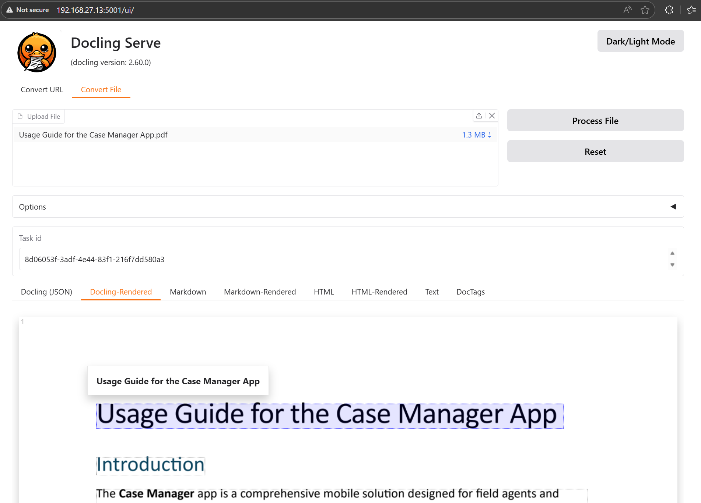

API documentation panel showing integration endpoints for programmatic access:

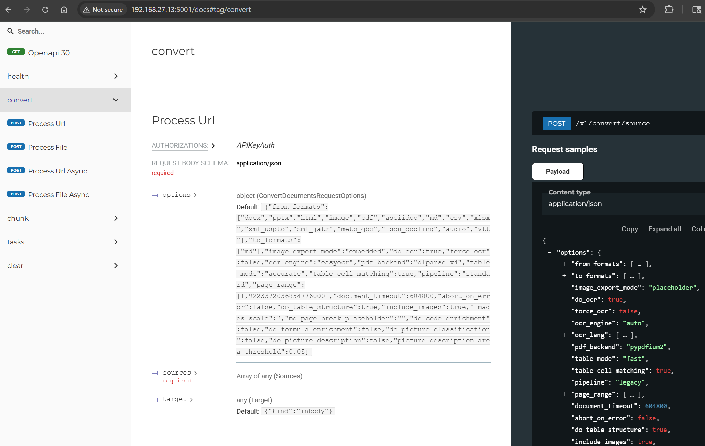

---

### 3.4 Real Time Transcription (WhisperLive)

#### 3.4.1 Beginners Start Here

**What this demo does:** Live speech-to-text transcription in the browser, supporting multiple languages and real-time processing.

**Why it matters to business:** Captures spoken conversations instantly, enabling better note-taking, accessibility, and analysis of meetings, calls, and interviews without manual transcription.

**Three steps to start it:**
1. Run `docker compose -f docker-compose.yml up -d whisperlive`.
2. Open `http://localhost:8501` in a browser.
3. Allow microphone access and start speaking to see live transcription.

**Recognition screenshot:** Live transcription interface showing real-time text output from speech.

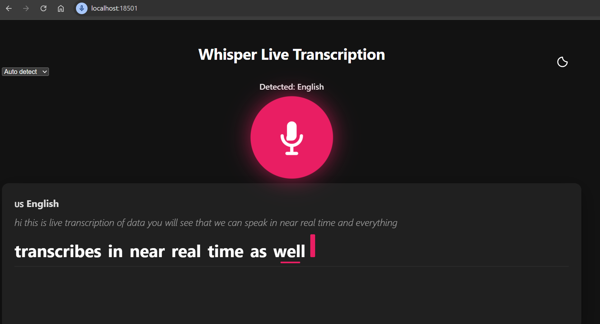

**How to talk about this demo on a call:** "WhisperLive demonstrates real-time AI transcription. As I speak, watch the text appear instantly—perfect for live meetings, customer calls, or accessibility. It handles multiple languages and runs locally for privacy."

#### 3.4.2 Concept

Enterprises run on conversations: sales calls, support lines, interviews, and internal meetings. Much of that value disappears because it is not captured.

Real Time Transcription turns live speech into text on the fly in the browser.

#### 3.4.3 Starting the service

```bash
docker compose -f docker-compose.yml up -d whisperlive
```

Open the UI:

```text
http://localhost:8501
```

If the demo runs from a jump host or remote server and browser microphone permissions are required, SSH tunnels can be configured as described in the Sensory AI documentation. For local demonstrations, the URL can be opened directly.

#### 3.4.4 Screenshots

Live transcription interface showing real-time text generation from spoken input (look for immediate text updates as audio is processed):


Multilingual transcription example with automatic language detection (note the language indicator and accurate foreign text rendering):

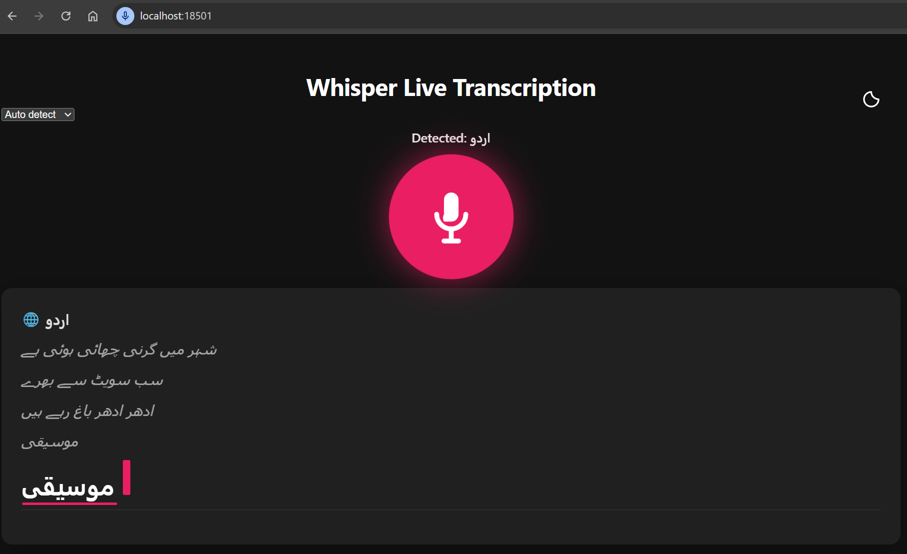

Browser extension setup for integrated toolbar access in Chrome or Edge browsers:

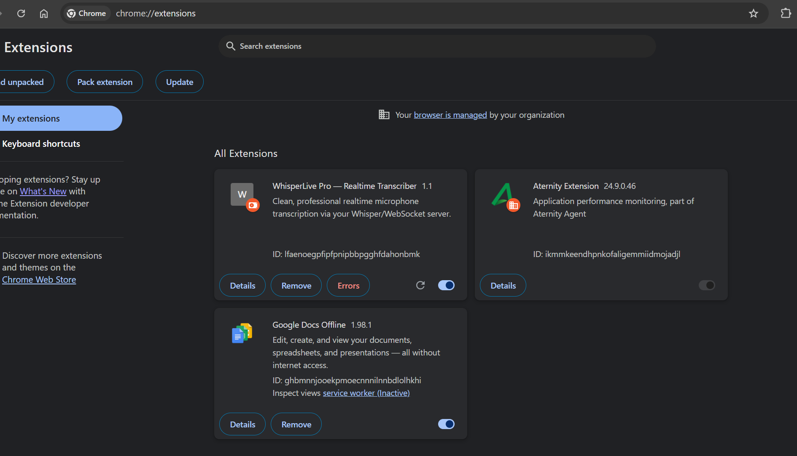

---

### 3.5 Meeting AI (Multimedia Intelligence)

#### 3.5.1 Beginners Start Here

**What this demo does:** Local web app that processes recorded meetings to generate transcripts, speaker diarization, and summaries.

**Why it matters to business:** Automates meeting documentation, improves accessibility, and extracts actionable insights from conversations without manual note-taking.

**Three steps to start it:**
1. Run `docker compose -f docker-compose.yml up -d meeting_ai`.
2. Open `http://localhost:3880` in a browser.
3. Upload a meeting recording to see transcription and summary.

**Recognition screenshot:** Meeting upload interface with transcription and speaker labels.


**How to talk about this demo on a call:** "Meeting AI turns recorded conversations into structured notes. Upload any meeting audio, and it separates speakers, transcribes everything, and generates summaries—keeping everything local for privacy."

#### 3.5.2 Concept

Rather than taking manual notes in meetings, participants can:

* Record audio or screen captures.
* Allow Meeting AI to separate speakers.
* Generate transcripts and structured summaries.
* Keep processing local for privacy.

Meeting AI is a local web application that accepts recorded meetings and produces:

* High quality transcripts.
* Speaker diarization and labels.
* Topic centric summaries.
* Suggested action items.

Sample meeting recordings in the `assets/` folder:

* [DeGrasse.webm](landing/docs/assets/DeGrasse.webm)
* [Goodall.webm](landing/docs/assets/Goodall.webm)
* [Teresa.webm](landing/docs/assets/Teresa.webm)

#### 3.5.3 Starting the service

In `docker-compose.yml`, the service backing this UI is typically named `meeting_ai`:

```bash
docker compose -f docker-compose.yml up -d meeting_ai
```

Open the UI:

```text
http://localhost:3880
```

#### 3.5.4 Screenshots

Meeting recording interface for uploading audio or screen captures:

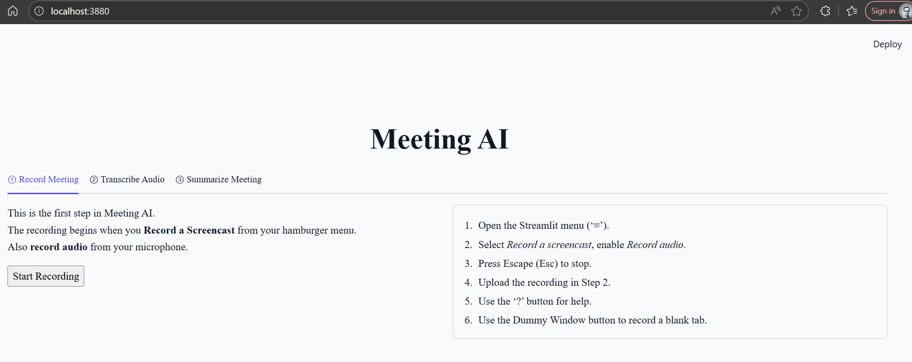

Speaker diarization results showing separated speakers with labels (look for color-coded segments and speaker identification):


Detailed transcription view with per-speaker text and timestamps:

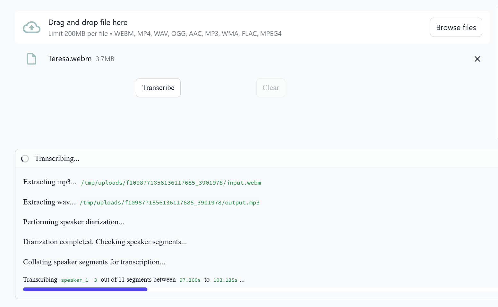

Summaries derived from the transcript, including topics and actions:

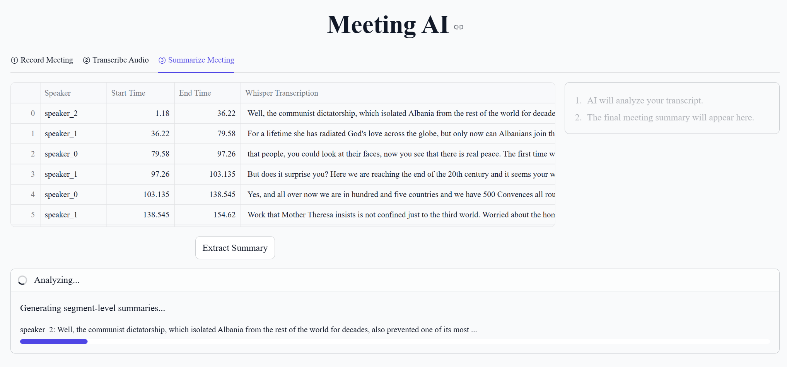

On device summarization for privacy sensitive or air gapped environments:

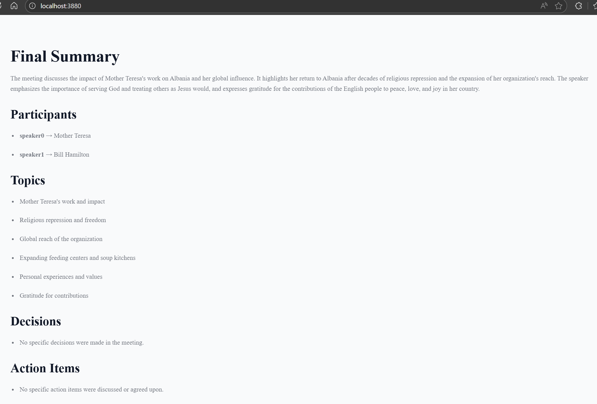

---

### 3.6 Video Intelligence (Traffic Tracking)

#### 3.6.1 Beginners Start Here

**What this demo does:** Real-time vehicle detection and tracking in video feeds using YOLO segmentation.

**Why it matters to business:** Provides automated traffic analytics, bottleneck detection, and operational insights from video without manual counting.

**Three steps to start it:**
1. Run `docker compose -f docker-compose.yml up -d traffic_tracker`.
2. Open the Streamlit app URL.
3. Upload or load a traffic video to see vehicle tracking.

**Recognition screenshot:** Video feed with vehicle segmentation masks and tracking IDs.


**How to talk about this demo on a call:** "This video intelligence demo uses AI to track vehicles in real-time. Watch as it detects, segments, and follows each car with unique IDs—perfect for traffic management, security, or logistics optimization."

#### 3.6.2 Concept

In many operations contexts, individual frames of video are less important than counts, patterns, bottlenecks, and anomalies.

The video tracking demo illustrates how the system can be used to:

* Detect and segment vehicles in a live or recorded feed.
* Track each object with a stable identifier.
* Build analytics on top of those tracks (volume, dwell time, lane usage).

Sample traffic videos in the `assets/` folder:

* [highway.mp4](landing/docs/assets/highway.mp4)
* [highway_processed_output.mp4](landing/docs/assets/highway_processed_output.mp4)

#### 3.6.3 Starting the service

The tracker is typically implemented as a small web app (often Streamlit) backed by a YOLO segmentation model. In `docker-compose.yml`, look for a service referencing YOLO or traffic tracking and start it, for example:

```bash
docker compose -f docker-compose.yml up -d traffic_tracker
```

Then open the configured URL and load the sample highway video.

#### 3.6.4 Screenshots

Real-time vehicle detection in traffic video with bounding boxes around each vehicle:

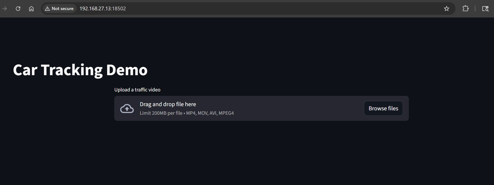

YOLO segmentation masks isolating individual vehicles from the background (look for precise outlines and separation):

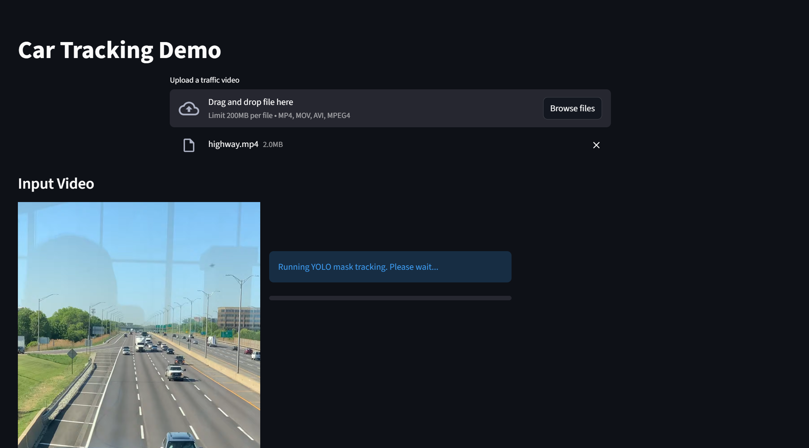

Tracking analytics showing unique IDs and movement trajectories for each vehicle:

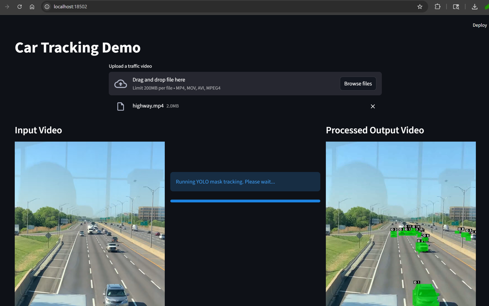

---

## 4. Generative AI Deep Dives

Once perception is established through Sensory AI, the narrative progresses to value creation: text, media, code, and research.

A simple framing line:

> “Now that the system can see and hear what is happening, it can be asked to summarize, translate, ideate, and even propose software changes.”

### 4.1 Generative AI Demo Map

| Demo                       | What it does                                                       | Typical URL                                                                                                   |
| -------------------------- | ------------------------------------------------------------------ | ------------------------------------------------------------------------------------------------------------- |
| Ollama LLMs                | Runs open source LLMs locally for chat, Q&A, and structured output | API often at `http://localhost:11434`; translation assistant at `http://localhost:8503/translation_assistant` |
| OpenWebUI                  | ChatGPT style interface over local or remote models                | `http://localhost:34000`                                                                                      |
| ComfyUI (Stable Diffusion) | Node based canvas for image and multimedia generation              | `http://localhost:8188`                                                                                       |
| Coding Assistant           | Moves from JIRA ticket to Git and deployment with AI help          | `http://localhost:8503/coding_assistant`                                                                      |
| Whybot / Deep Research     | Multi step research agent (why, what, who, when, where, how)       | `http://localhost:3003`                                                                                       |
| Search Assistant           | Generative search interface over complex data                      | Environment specific                                                                                          |
| PowerPoint Agent           | Produces “10 second” slide decks inside PowerPoint                 | Appears as a ribbon add-in                                                                                    |
| Flowise RAG Builder        | Visual canvas for retrieval augmented agents                       | `http://localhost:33000`                                                                                      |
| Demand Letter Parsing      | Multimodal extraction and response for insurance demand letters    | `http://localhost:8503/demand_letters`                                                                        |
| Data Cataloging Agent      | Automatically annotates tables and data warehouses                 | Part of data and search stack                                                                                 |
| SQL Assistant              | Conversational interface that produces SQL and results             | Part of analytics and catalog stack                                                                           |

The exact services and ports are defined in `docker-compose.yml`. A common pattern for bringing up several generative components together might look like:

```bash
# Example only. Adjust service names to match docker-compose.yml.
docker compose -f docker-compose.yml up -d ollama openwebui comfyui flowise streamlit_apps
```

---

### 4.2 Ollama: LLMs for Everyone

#### 4.2.1 Beginners Start Here

**What this demo does:** Runs open-source large language models locally for chat, Q&A, summarization, and translation.

**Why it matters to business:** Provides AI capabilities without relying on external APIs, ensuring data privacy and control over enterprise information.

**Three steps to start it:**
1. Run `docker compose -f docker-compose.yml up -d ollama`.
2. Pull a model (e.g., via API or OpenWebUI).
3. Interact via API at `http://localhost:11434` or through OpenWebUI.

**Recognition screenshot:** Ollama model serving different human-like roles.

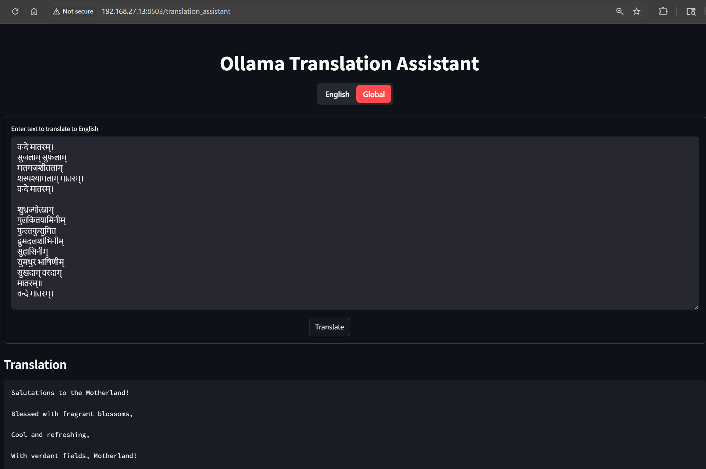

**How to talk about this demo on a call:** "Ollama brings powerful language models to your infrastructure. Unlike cloud APIs, this runs locally—perfect for sensitive data, compliance, and cost control. Watch as it handles translation, summarization, or acts as an advisor."

#### 4.2.2 Concept

Ollama hosts large language models on enterprise infrastructure, which enables:

* Independence from external APIs.
* Control over data privacy and retention.
* Flexibility to adopt new open source models quickly.

Typical use cases include:

* Chat and Q&A over internal content.
* Summarization and rewriting.
* Translation between languages.
* Structured extraction into JSON for downstream systems.

#### 4.2.3 Screenshots

Ollama concept overview emphasizing local, private model deployment:


Model configured for different human roles like advisor or translator (look for role-specific prompts and responses):


Translation use case showing multilingual capabilities:

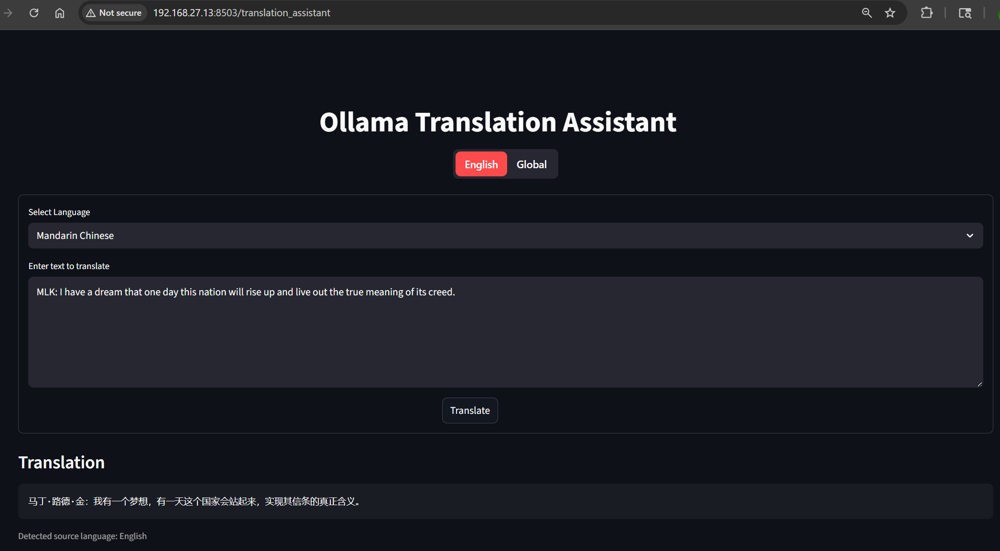

---

### 4.3 OpenWebUI: ChatGPT Style Experience On Premise

#### 4.3.1 Concept

OpenWebUI is a browser based interface that looks and feels like ChatGPT but runs on enterprise infrastructure. It provides:

* Multi model chat (for example, switching between different Ollama models).
* Persistent conversations.
* Memory and history.
* Support for knowledge bases and prompt libraries.

A sample resume used as a knowledge file is included in `assets/`:

* [resume.md](landing/docs/assets/resume.md)

#### 4.3.2 Screenshots

Main chat interface, with a familiar ChatGPT style experience:

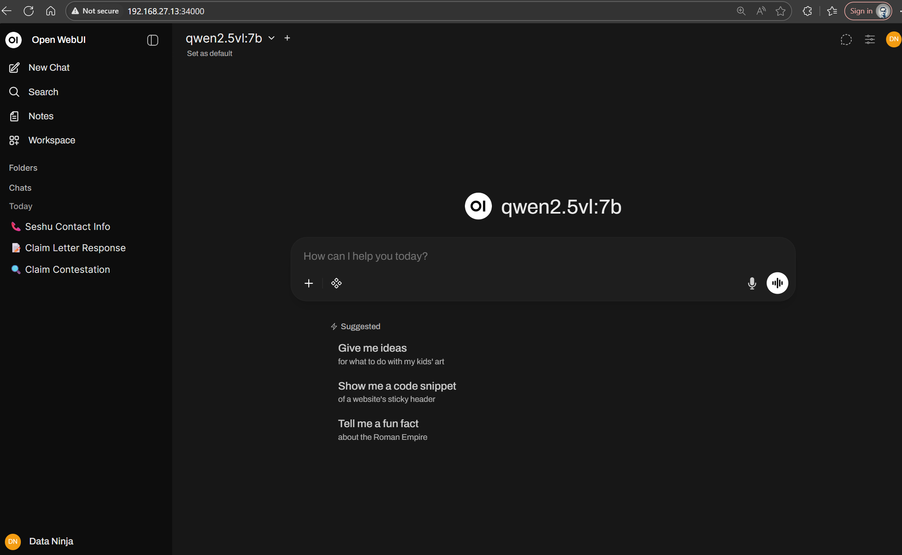

Multi turn conversations with saved outcomes:

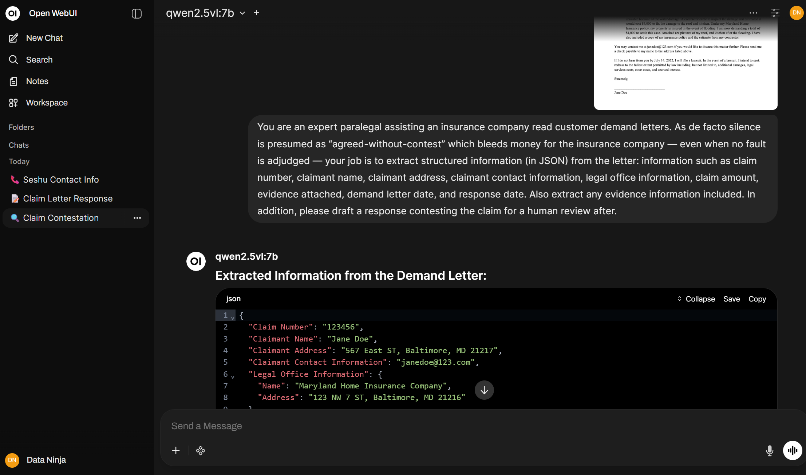

Management of complex knowledge agents:

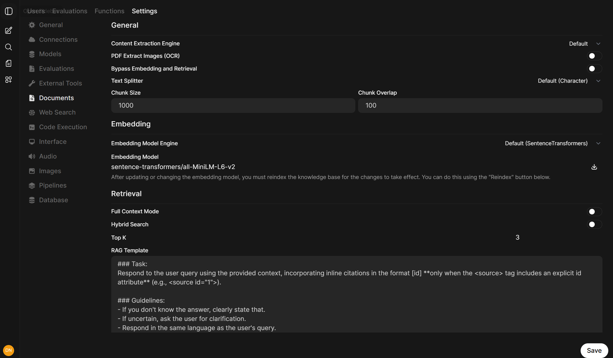

Custom prompt shortcuts functioning as a lightweight prompt library:

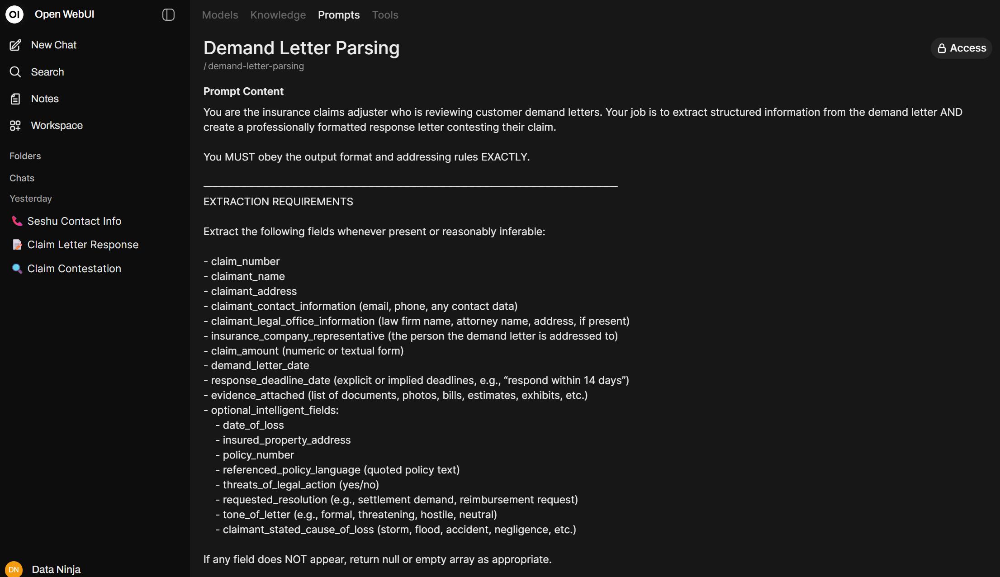

Enterprise knowledge bases, including connectors such as SharePoint:

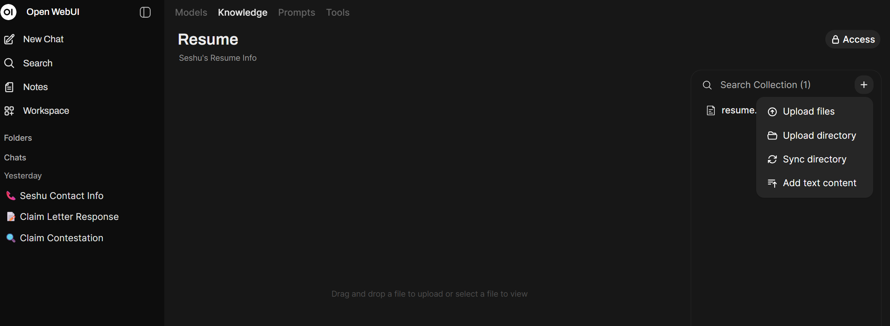

Custom models seeded with enterprise knowledge:


Multimodal inputs and reinforcement feedback:

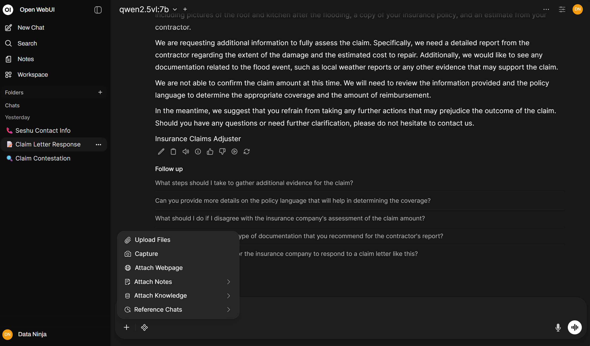

---

### 4.4 ComfyUI: Visual Multimedia Generation

#### 4.4.1 Concept

ComfyUI brings generative media workflows into a visual canvas. Instead of writing code, users can:

* Drag and drop nodes.
* Connect models and processors.
* Tweak parameters.
* Generate images or video variations.

A sample workflow is provided in `assets/`:

* [flux_schnell.json](landing/docs/assets/flux_schnell.json)

This file can be imported into ComfyUI and executed once the corresponding model weights are downloaded.

#### 4.4.2 Screenshots

Starter canvas templates that can be loaded and customized:

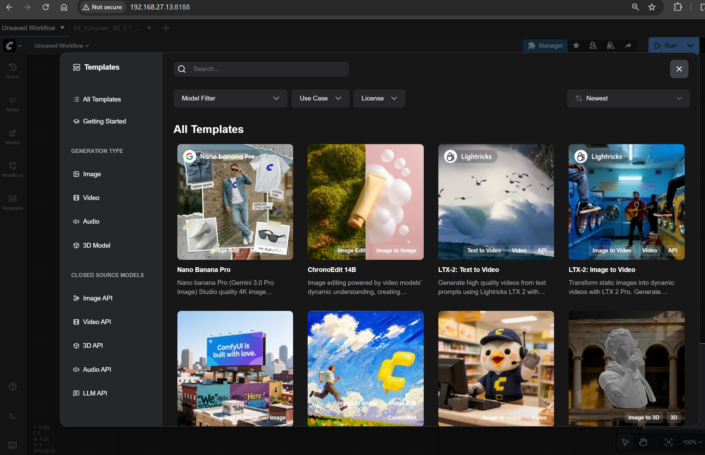

Graphical model manager and module installation:

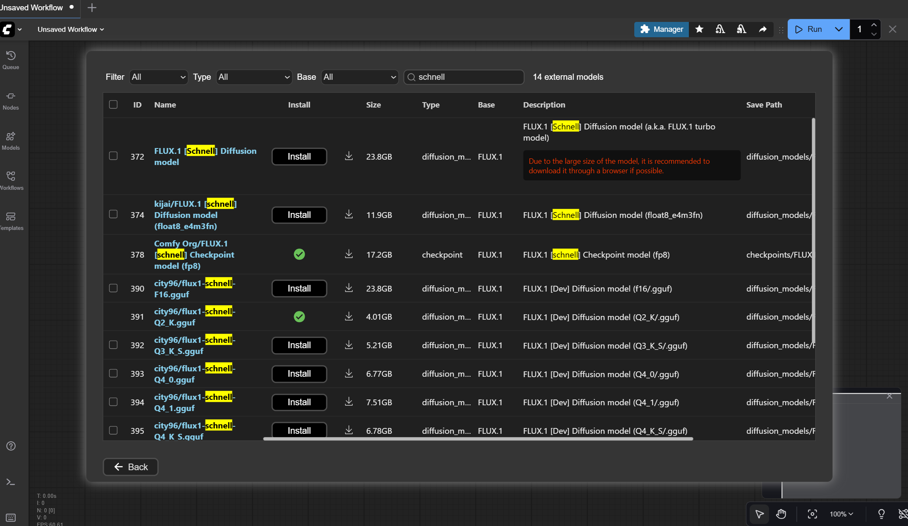

Assembled pipelines connecting prompts, models, and outputs:

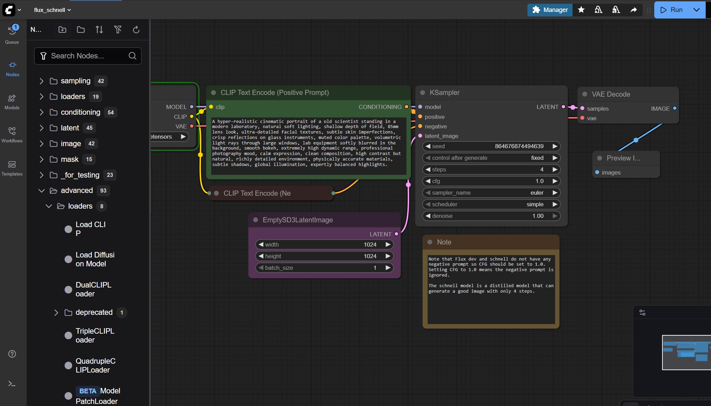

Generated multimedia outputs:


---

### 4.5 Coding Assistant: From Ticket to Cloud

#### 4.5.1 Concept

Software delivery is often slowed by handoffs:

* Product management writes requirements.
* Engineers translate those into code.
* DevOps teams handle deployment.

The Coding Assistant shortens this loop by:

* Reading tickets from systems such as JIRA.
* Proposing implementation plans.
* Drafting code.
* Assisting with deployment scripts.

#### 4.5.2 Screenshots

End to end flow from ticket to deployed code in hours rather than sprints:

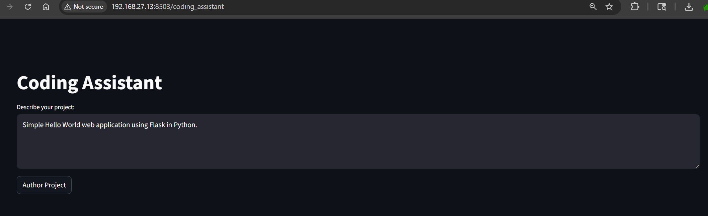

Planning, estimation, and fulfillment across roles:

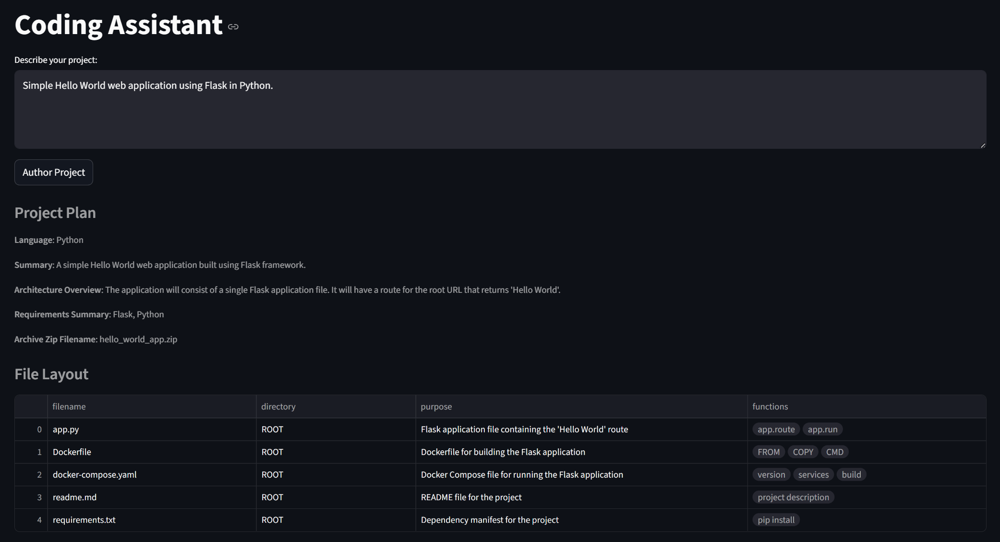

Consistent archetypes and multi turn steering of the assistant:

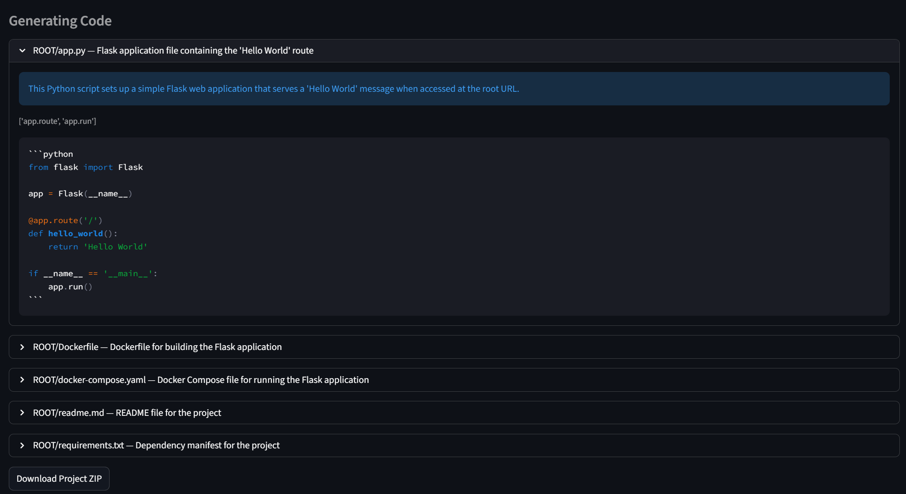

---

### 4.6 Deep Research (Whybot and Search Companion)

#### 4.6.1 Beginners Start Here

**What this demo does:** Multi-step research agent that breaks down questions and synthesizes findings from multiple sources.

**Why it matters to business:** Transforms basic search into deep, structured insights, saving time on complex research tasks like market analysis or due diligence.

**Three steps to start it:**
1. Run `docker compose -f docker-compose.yml up -d whybot`.
2. Open `http://localhost:3003` in a browser.
3. Enter a research question and let the agent explore.

**Recognition screenshot:** Research agent progressively building knowledge through iterative questioning.

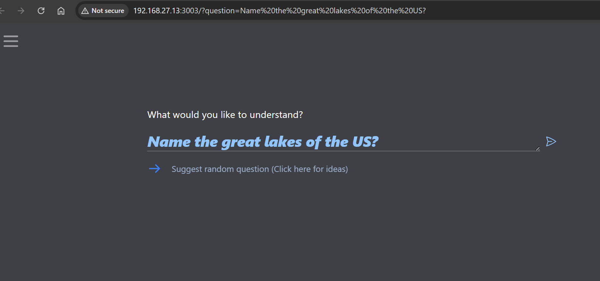

**How to talk about this demo on a call:** "Deep Research is like having a research assistant that doesn't stop at the first answer. It asks follow-up questions, explores sources, and builds a comprehensive report—ideal for analysts, consultants, or anyone needing thorough insights."

#### 4.6.2 Concept

Traditional search yields links, whereas deep research tools deliver synthesized understanding.

The deep research demos illustrate an agent that:

* Breaks a question into sub questions.
* Iteratively explores relevant sources.
* Consolidates findings into structured reports.
* Supports follow up questions and deeper probes.

#### 4.6.3 Screenshots

Research agent using "pearl growing" to expand knowledge progressively (look for expanding circles of information):


Iterative probing into multiple dimensions (why, what, how, when, who, where) of a topic:

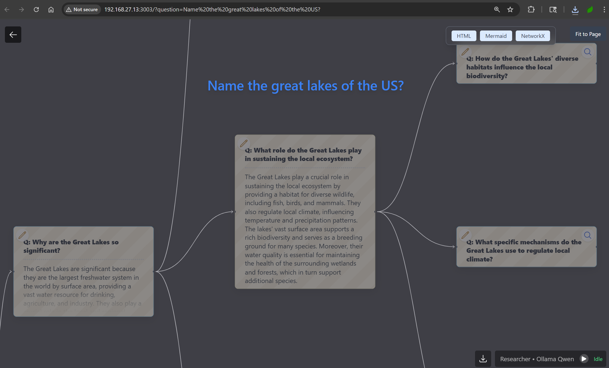

---

### 4.7 PowerPoint Agent: Ten-Second Slides

#### 4.7.1 Concept

Executives and managers spend significant time preparing slides. The PowerPoint Agent:

* Runs directly inside PowerPoint as an add-in.
* Accepts a short brief or topic.
* Generates slides in seconds.
* Uses organizational knowledge bases for content.

#### 4.7.2 Screenshots

Installation of the add-in into the Office suite:

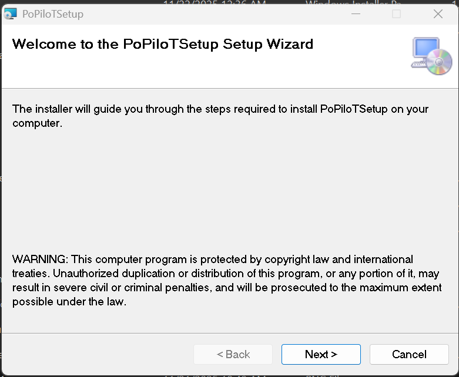

Add-in visible inside PowerPoint:

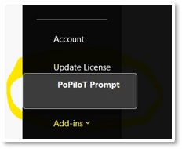

Configuration window for setting up the agent and connecting knowledge:

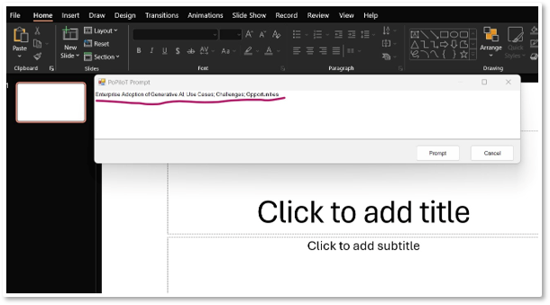

Slide deck generated from deep research over custom knowledge:

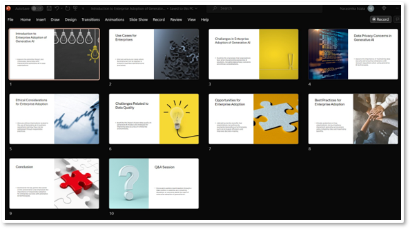

---

### 4.8 Semantic Search and Data Cataloging

#### 4.8.1 Concept

Many organizations are flooded with data but starved for context. Common challenges include:

* Tables with little or no metadata.
* Difficulty discovering which dataset answers which question.

The semantic search and data cataloging stack addresses this by:

* Allowing LLMs to inspect and annotate tables.
* Building a living data catalog.
* Enabling natural language search and SQL generation.

#### 4.8.2 Screenshots

Why brittle keyword search is not enough:

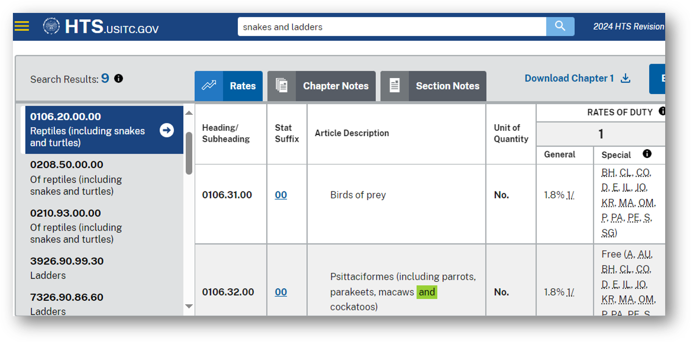

LLMs introducing deep domain expertise into search:

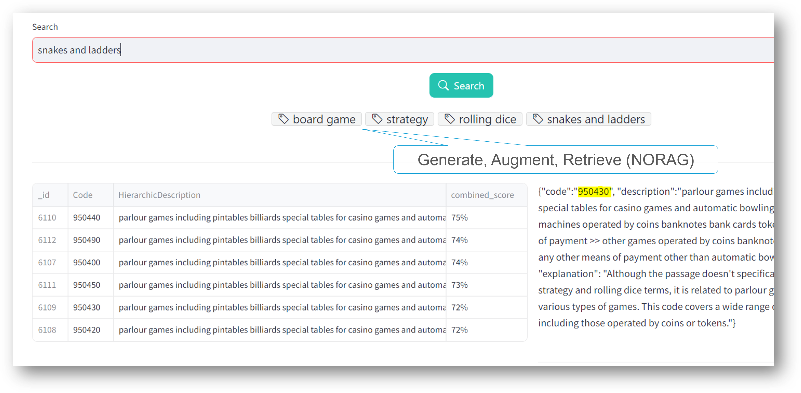

Data without sufficient metadata:


LLMs acting as stewards for data cataloging:

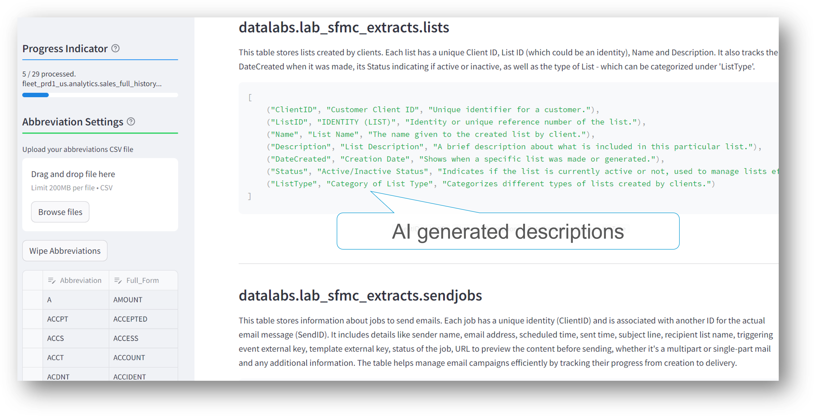

Annotated datasets enabling natural language insights:

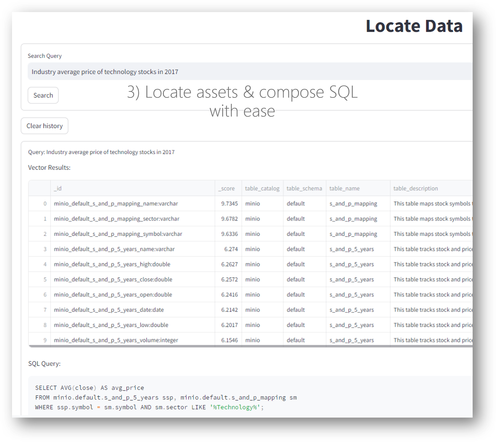

Annotated catalogs supporting structured queries from English and deep tool usage:

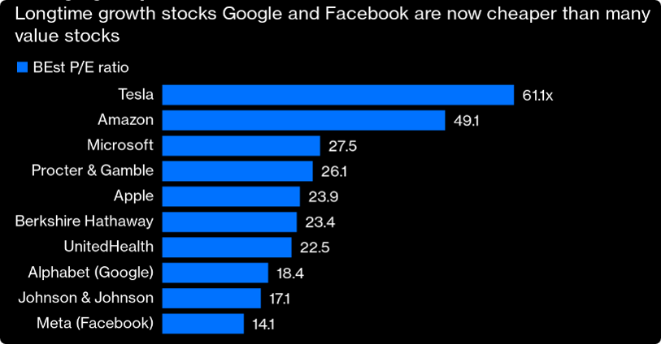

---

### 4.9 Flowise: Visual RAG Builder

#### 4.9.1 Concept

Flowise acts as an orchestration canvas. It enables:

* Drag and drop composition of retrievers, models, and tools.
* Visual definition of control flow.
* Inline testing of prompts and flows.
* Deployment as APIs or web apps.

A sample Flowise workflow in the `assets/` folder:

* [ChatRAGFlow.json](landing/docs/assets/ChatRAGFlow.json)

This file can be imported into Flowise to create a retrieval-augmented chatbot.

#### 4.9.2 Screenshots

Workflow composer showing how components connect:

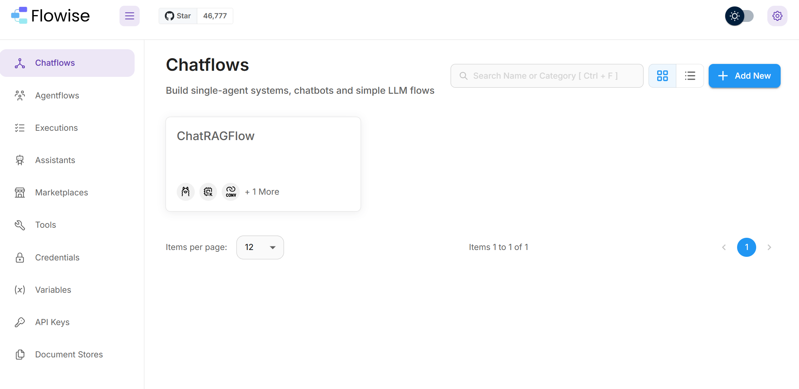

WYSIWYG representation of flows:


Integrated prompt testing node:

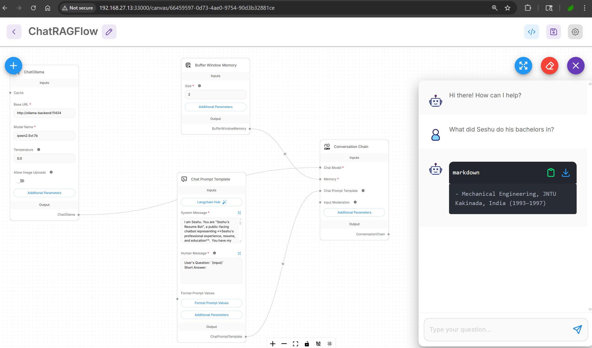

Design and deployment views for in-situ experimentation:

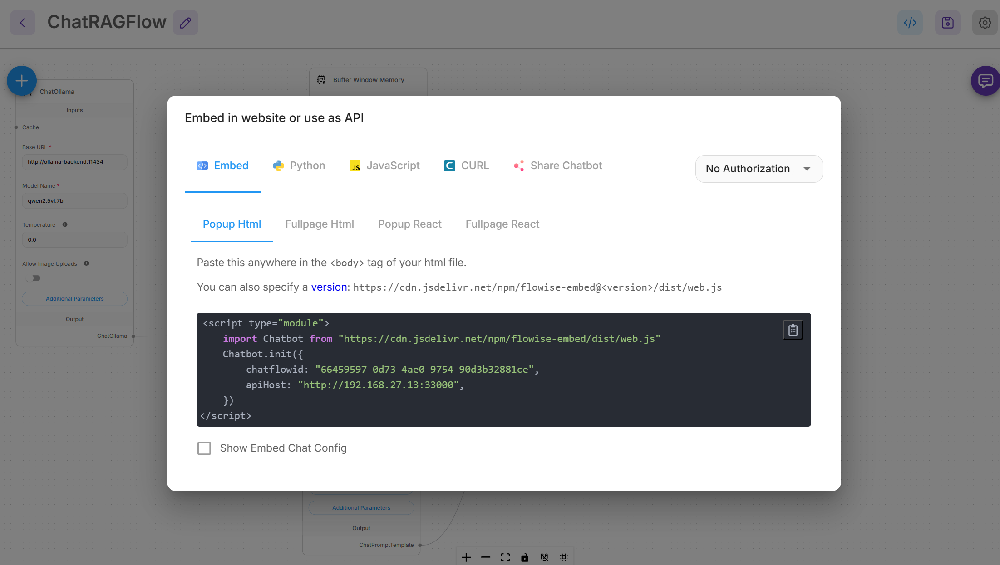

Deployment to existing endpoints while reusing infrastructure:

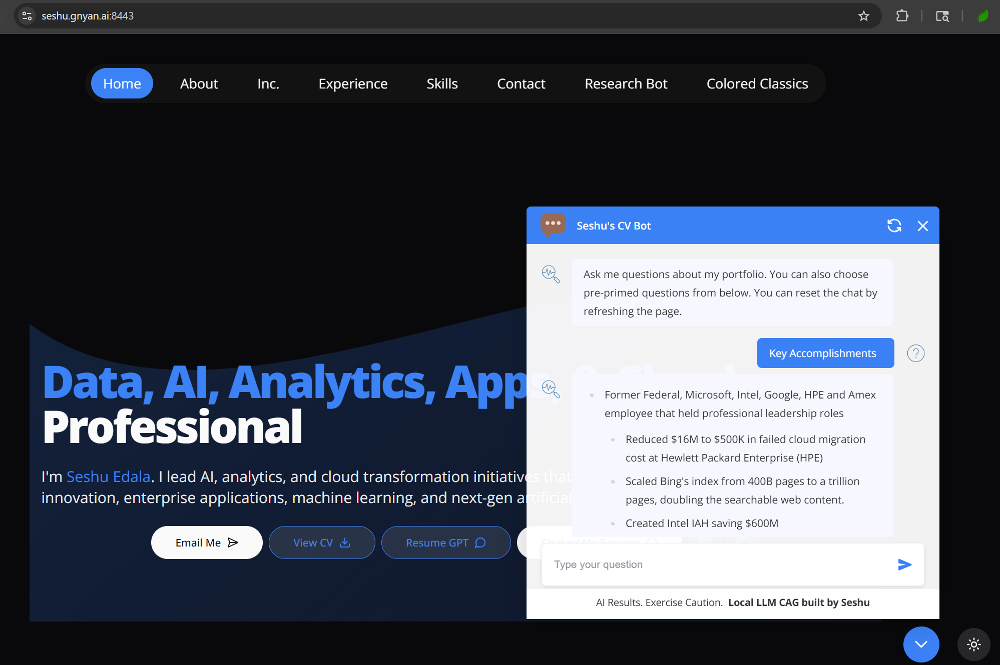

---

### 4.10 Demand Letter Parsing (Insurance)

#### 4.10.1 Concept

Insurance adjusters receive complex demand letters that mix text, tables, and images. Manual reading, extraction, and response drafting is time consuming and can be inconsistent.

The demand letter parsing demo:

* Accepts demand letters as PDF, image, or text.
* Uses a multimodal LLM to extract key entities (claimant, amounts, dates, evidence).
* Generates a professional acknowledgement or rebuttal letter.
* Displays structured JSON plus the generated response.

Sample input in `assets/`:

* [Sample_Insurance_Demand_Letter_Property_Damage.png](landing/docs/assets/Sample_Insurance_Demand_Letter_Property_Damage.png)

#### 4.10.2 Screenshots

Initial parsing of an uploaded demand letter:

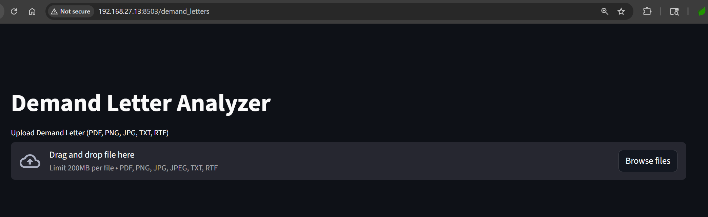

Parsed structure and suggested response letter:

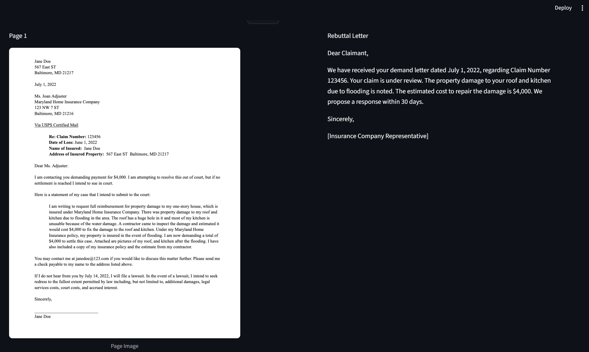

Lexical intelligence extracted from the document:

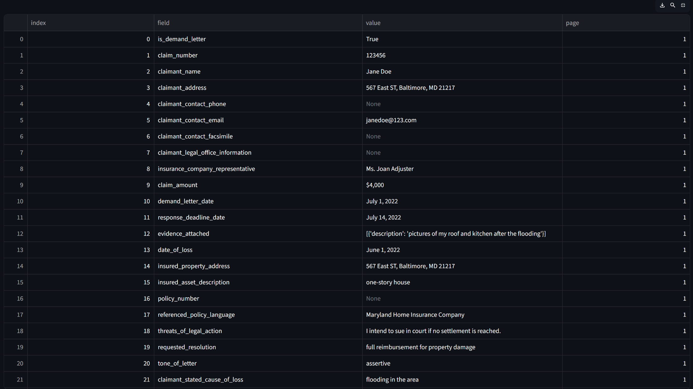

---

## 5. Agentic AI: From Capabilities to Workflows

Agentic AI is not a single application. It is a way of composing perception and generation into reliable workflows that act.

### 5.1 Agent Architecture: Observe → Think → Plan → Act → Learn

A unified agent follows this loop:

```
Observe → Think → Plan → Act → Learn
    ↑                           ↓
    └────── Feedback Loop ──────┘
```

- **Observe**: Gather data from the world (sensors, documents, conversations).
- **Think**: Analyze and understand the inputs using perception models.
- **Plan**: Break down tasks into steps, considering tools and constraints.
- **Act**: Execute actions, call APIs, generate outputs.
- **Learn**: Incorporate feedback to improve future decisions.

This pattern is implemented across the demos:

- **Sensory AI contributes to Observe/Think**: Case Manager, Docling, WhisperLive, Meeting AI, and Traffic Tracking provide the perception layer—extracting structured data from unstructured inputs.
- **Generative AI contributes to Think/Plan**: Ollama, OpenWebUI, ComfyUI, and Coding Assistant enable reasoning, ideation, and content creation.
- **Agentic AI orchestrates the loop**: Whybot/Deep Research, Flowise, and Demand Letter Parsing demonstrate full agent workflows, combining perception and generation into autonomous actions.

### 5.2 Design considerations

Agentic capabilities benefit from clear guardrails:

* Every decision is traceable with logs and audit trails.
* Actions that change systems can be gated behind approvals.
* Workflows are resilient, with retries, fallbacks, and timeouts.
* Permissions and scopes are enforced at each tool boundary.

These patterns build on the demos already described:

* Meeting AI behaves as an agent that reads audio, plans diarization, then produces transcripts and summaries.
* Deep research behaves as an agent that repeatedly asks internal sub-questions while exploring a topic.
* Flowise is explicitly an agent builder, wiring perception, retrieval, and action nodes.
* Demand letter parsing is an agent specialized for a single document-centric workflow.

### 5.2 Example agent flows

#### 5.2.1 Customer case lifecycle

1. A field agent uses the Case Manager app to capture photos, voice notes, and signed documents for a new case.
2. Documents from the case are processed through Docling for OCR and structuring.
3. A Meeting AI session with the customer is recorded and summarized.
4. A Flowise-built agent orchestrates:

   * Retrieval of relevant policy documents.
   * Use of an Ollama-backed LLM to compare the case to policy.
   * Drafting of a response using the demand letter agent where appropriate.
5. The PowerPoint agent generates a concise internal briefing deck for review.

#### 5.2.2 Data stewardship agent

1. Tables and datasets are profiled by a background process.
2. A data cataloging agent uses LLMs to infer column meanings and relationships.
3. The agent writes annotations into the catalog.
4. The SQL assistant and search assistant leverage these annotations to answer natural language questions such as “Show churn by region over the last six months.”

In both examples, the agent is a composition of capabilities described earlier: perception (Sensory AI), generation (Generative AI), and action (Agentic orchestration).

---

## 6. Quick Docker Compose Reference

This section acts as a checklist for the most common services when preparing a demo.

> Adjust service names to match the `docker-compose.yml` file in the environment. The examples illustrate typical patterns.

### 6.1 Portal and Navigation

```bash
# Portal landing page
docker compose -f docker-compose.yml up -d --build landing
```

### 6.2 Sensory AI

```bash
# Docling OCR and document parsing
docker compose -f docker-compose.yml up -d docling

# Real time speech to text (WhisperLive)
docker compose -f docker-compose.yml up -d whisperlive

# Meeting AI (service name)
docker compose -f docker-compose.yml up -d meeting_ai

# Video intelligence / traffic tracker (service name)
docker compose -f docker-compose.yml up -d cartracker
```

### 6.3 Generative and Agentic Stack (examples)

```bash
# Core model and chat stack (example)
docker compose -f docker-compose.yml up -d ollama openwebui

# Visual RAG and orchestration (example)
docker compose -f docker-compose.yml up -d flowise

# Media generation (example)
docker compose -f docker-compose.yml up -d comfyui

# Streamlit-based assistants: coding, demand letters, translation (example)
docker compose -f docker-compose.yml up -d streamlit_apps
```